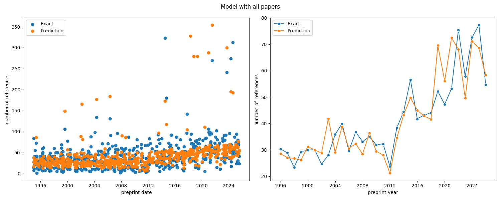
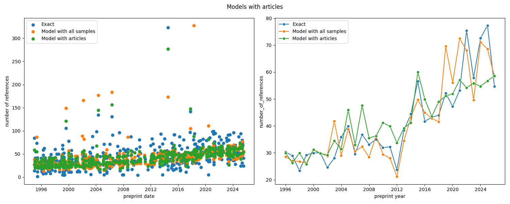

# Reference inflation in academia

**A Data Science Project to Predict the Number of References in 'nucl-th' Physics Papers**

This project investigates the trend of "reference inflation" in academic publishing, specifically within the **Nuclear Theory (nucl-th)** subfield of physics. It involves collecting metadata from the [InspireHEP](https://inspirehep.net) database, performing exploratory data analysis, and building a machine learning model to **predict the number of references** a paper will have.

The final model, an **XGBoost Regressor**, is deployed as a REST API using FastAPI and Docker.

-----


## Problem Statement

Academic citation practices have evolved significantly. Historically, accessing papers was difficult, limiting the number of references. Today, with ubiquitous digital access and preprints on platforms like [arXiv](https://arXiv.org), this barrier is removed.

This has led to a noticeable "inflation" in the number of references. It is not uncommon to see 5-page letters with over 150 references, many of which may not be directly related to the core research. This project hypothesizes that this trend is correlated with paper metadata (like publication year, document type, and author count).

The goals are twofold:

1.  **Analyze** the trend of reference counts over time.
2.  **Build** a machine learning model to predict a paper's reference count based on its metadata.


-----


## The Dataset

### Data Source

The dataset is sourced from [**InspireHEP**](https://inspirehep.net), the primary database for high-energy and nuclear physics. This source was chosen over:

  * **arXiv:** Which lacks comprehensive, structured citation data.
  * **Google Scholar:** Which often includes presentations, making the data noisy.

InspireHEP is meticulously maintained by the high-energy physics community, making it the most reliable source for this domain.


### Data Collection

Data was collected via the InspireHEP API, focusing on the **"nucl-th" (Nuclear Theory)** category. Due to API limitations and to create a manageable dataset, the collection process involved:

1.  **Querying by Year:** Bypassing the 10,000-entry API limit by segmenting requests by year.
2.  **Deduplication:** Handling duplicates that arise from different paper versions (e.g., a v1 in 2022 and a v2 in 2023).
3.  **Sampling:** To enable local development, a final dataset was created by **randomly sampling 100 papers per year** (1995-2025), resulting in ~3100 papers.

The full collection and preprocessing steps are documented in [notebook/data_collection.ipynb](notebook/data_collection.ipynb) and [notebook/data_preprocessing.ipynb](notebook/data_preprocessing.ipynb).


### Feature Descriptions

The final cleaned dataset (`data/data_nucl-th_100_cleaned.csv`) includes the following features:

| Features | Description |
| :--- | :--- |
| **number_of_pages** | The number of page for a given paper. |
| **author_count** | The number of authors for a given paper. |
| **preprint_date** | The date the paper was first uploaded to arXiv. |
| **document_type** | Type of paper: 'article', 'conference paper', 'book chapter', 'thesis'. |
| **publication_type** | Publication type: 'research', 'review', 'lectures'. |
| **number_of_references** | **(Target)** The number of papers this paper cites. |


-----


## Exploratory Data Analysis (EDA)

The initial analysis, detailed in [notebook/notebook.ipynb](notebook/notebook.ipynb), confirmed the central hypothesis: **the number of references in papers generally increases over time.**

This trend, however, is also heavily influenced by `document_type` and `publication_type`. 


-----


##  Model Selection and Training


Two modeling experiments were conducted, with **Mean Squared Error (MSE)** as the primary evaluation metric.

### Experiment 1: All Document Types

This experiment used the full dataset to build a general-purpose model.

  * **Ridge Regression ($L_2$):** Best MSE of `758.85`.
  * **Tree-Based Models (XGBoost):** An **XGBoost Regressor** provided the best performance with a significantly lower MSE of **`416.70`**.

### Experiment 2: "Articles" Only

Since 'articles' are the most common and homogenous type, a separate experiment was run on this subset.

  * **Ridge Regression ($L_2$):** Best MSE of `474.77`.
  * **Random Forest:** This model performed best for this specific subset, with an MSE of **`383.16`**.


### Final Deployed Model

For the public-facing API, the **XGBoost Regressor** trained on **all document types** was selected, as it provides the most general-purpose prediction.

The script `src/train.py` is used to train this final model, which is then saved to `bin/model.bin` for deployment. The `.pkl` files in the `bin/` directory are artifacts from the notebook-based experiments.


-----

## Model Performance & Results

The plots below visualize the final model's prediction performance on the test set, showing the relationship between the actual number of references and the model's predictions.


**Results for the XGBoost model (All Data):**




**Results for the Random Forest model (Articles Only):**





-----


## Deployment with FastAPI & Docker

The trained XGBoost model is served via a FastAPI application, which can be run locally or deployed using Docker. This project uses [**uv**](https://github.com/astral-sh/uv) for fast Python package management.

### Prerequisites

First, install `uv` (on macOS/Linux):

```bash
curl -LsSf https://astral.sh/uv/install.sh | sh
```


### Option 1: Run Locally (without Docker)

1.  **Install dependencies** from the lockfile:

    ```bash
    uv sync --locked
    ```

2.  **Run the FastAPI server:**

    ```bash
    uv run python src/serve.py
    ```


### Option 2: Run Locally (with Docker)

1.  **Build the Docker image:**

    ```bash
    docker build  --platform=linux/amd64 -t reference-inflation .
    ```

2.  **Run the container,** mapping port 9696:

    ```bash
    docker run -it --rm --platform=linux/amd64 -p 9696:9696 reference-inflation
    ```

### Testing the Endpoint

Once the server is running (using either method), you can access the Swagger UI at [http://localhost:9696/docs](http://localhost:9696/docs) or send a `POST` request to the `/predict` endpoint.

**Example `curl` Request:**

```bash
curl -X 'POST' \
  'http://localhost:9696/predict' \
  -H 'accept: application/json' \
  -H 'Content-Type: application/json' \
  -d '{
    "number_of_pages": 20,
    "author_count": 3,
    "preprint_date": "1995-03-25",
    "document_type": "article",
    "publication_type": "research"
  }'
```


**Expected Response:**

```json
{
  "number_of_references":30.794631958007812
}
```

-----

### Retrain the Model

To retrain the deployment model (e.g., after data changes), run the training script. This will update the `bin/model.bin` file used by the API.

```bash
uv run python src/train.py
```


-----


## Project structure
```
├── bin
│   ├── model_article.pkl             # Model artifact from 'articles-only' experiment (notebook)
│   ├── model.pkl                     # Model artifact from 'all-data' experiment (notebook)
│   └── model.bin                     # Final production model trained by src/train.py
├── data
│   └── data_nucl-th_100_cleaned.csv  # Cleaned dataset
├── Dockerfile                        # Docker configuration
├── notebook
│   ├── data_collection.ipynb         # Notebook for data collection
│   ├── data_preprocessing.ipynb      # Notebook for data preprocessing
│   ├── notebook.ipynb                # Main notebook for EDA and model selection
│   ├── pyproject.toml                # Dependencies for the notebook
│   ├── uv.lock                       # Lockfile for notebook reproducibility
│   └── .python-version               # Python version for notebook reproducibility
├── pyproject.toml                    # Project dependencies (for src)
├── README.md                         # Project documentation
├── src
│   ├── predict.py                    # Script to load model and make predictions
│   ├── serve.py                      # FastAPI server to serve the model
│   ├── train.py                      # Script to train the final model
│   └── util.py                       # Script to contain utility functions
├── uv.lock                           # Lockfile for project reproducibility
├── .gitignore                        # Ignored files and directories
└── .python-version                   # Python version for deployment reproducibility

```

-----

## Future Work

  * **Compare Categories:** Extend the analysis to other arXiv categories (e.g., 'hep-th', 'astro-ph') to compare citation cultures.
  * **Feature Engineering:** Incorporate author-specific data (e.g., author's h-index, number of prior publications) to improve predictions.
  * **NLP Analysis:** Use NLP on abstracts to see if the paper's topic or methodology impacts its reference count.
  * **Time-Series Model:** Treat the reference count as a time-series problem to forecast future trends.

-----

## License

This project is licensed under the MIT License.